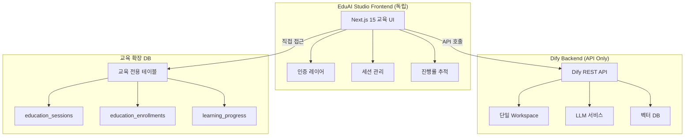

# EduAI Studio - API 전용 교육 플랫폼 아키텍처 (완전 라이센스 준수)

## 🎯 핵심 전략: Dify Backend API + 독립 Frontend

### 라이센스 준수 확인
```yaml
✅ 멀티테넌트 제거: 단일 workspace 사용
✅ Frontend 독립: Dify UI 미사용 (LOGO 제약 없음)
✅ Backend API 활용: 완전 합법적 사용
```

**Dify 라이센스 1.b 조항**:
> "This restriction is inapplicable to uses of Dify that do not involve its frontend"

→ **Dify 프론트엔드를 사용하지 않으므로 LOGO/저작권 제약 없음!**

## 시스템 아키텍처



## 데이터베이스 설계 (단일 테넌트)

### 1. Dify 기존 테이블 (수정 없음)
```sql
-- Dify 원본 스키마 그대로 사용
-- accounts, apps, workflows, datasets 등
-- 단일 workspace만 생성하여 모든 사용자 공유
```

### 2. 교육 전용 확장 테이블

#### education_sessions
```sql
CREATE TABLE education_sessions (
    id UUID PRIMARY KEY DEFAULT uuid_generate_v4(),
    name VARCHAR(255) NOT NULL,
    instructor_id UUID NOT NULL,
    session_code VARCHAR(20) UNIQUE NOT NULL,
    session_type VARCHAR(20) CHECK (session_type IN ('ONLINE', 'OFFLINE', 'HYBRID')),
    scheduled_start TIMESTAMP NOT NULL,
    scheduled_end TIMESTAMP NOT NULL,
    max_participants INTEGER DEFAULT 50,
    is_active BOOLEAN DEFAULT true,
    metadata JSONB,
    created_at TIMESTAMP DEFAULT NOW(),
    updated_at TIMESTAMP DEFAULT NOW(),
    FOREIGN KEY (instructor_id) REFERENCES accounts(id)
);

CREATE INDEX idx_session_code ON education_sessions(session_code);
CREATE INDEX idx_session_active ON education_sessions(is_active, scheduled_start);
```

#### education_enrollments
```sql
CREATE TABLE education_enrollments (
    id UUID PRIMARY KEY DEFAULT uuid_generate_v4(),
    user_id UUID NOT NULL,
    session_id UUID NOT NULL,
    role VARCHAR(20) DEFAULT 'STUDENT',
    enrolled_at TIMESTAMP DEFAULT NOW(),
    completed_at TIMESTAMP,
    FOREIGN KEY (user_id) REFERENCES accounts(id),
    FOREIGN KEY (session_id) REFERENCES education_sessions(id),
    UNIQUE(user_id, session_id)
);
```

#### resource_tags (리소스 구분용)
```sql
CREATE TABLE resource_tags (
    id UUID PRIMARY KEY DEFAULT uuid_generate_v4(),
    resource_type VARCHAR(50) NOT NULL, -- 'app', 'workflow', 'dataset'
    resource_id UUID NOT NULL,
    tag_key VARCHAR(50) NOT NULL,
    tag_value VARCHAR(255) NOT NULL,
    created_by UUID NOT NULL,
    created_at TIMESTAMP DEFAULT NOW(),
    INDEX idx_resource_lookup (resource_type, resource_id),
    INDEX idx_tag_search (tag_key, tag_value)
);
```

#### learning_progress
```sql
CREATE TABLE learning_progress (
    id UUID PRIMARY KEY DEFAULT uuid_generate_v4(),
    user_id UUID NOT NULL,
    session_id UUID,
    module_code VARCHAR(50) NOT NULL,
    module_name VARCHAR(255) NOT NULL,
    status VARCHAR(20) DEFAULT 'NOT_STARTED',
    progress_percentage INTEGER DEFAULT 0,
    started_at TIMESTAMP,
    completed_at TIMESTAMP,
    time_spent_seconds INTEGER DEFAULT 0,
    metadata JSONB,
    FOREIGN KEY (user_id) REFERENCES accounts(id),
    FOREIGN KEY (session_id) REFERENCES education_sessions(id),
    UNIQUE(user_id, session_id, module_code)
);
```

## API 통합 전략

### 1. Dify API 래퍼 서비스 (재시도 로직 포함)
```typescript
// web-edu/services/DifyAPIService.ts
class DifyAPIService {
  private baseUrl = process.env.DIFY_API_URL;
  private apiKey = process.env.DIFY_API_KEY;
  private readonly MAX_RETRIES = 3;
  private readonly RETRY_DELAY = 1000;

  // 기본 API 호출 메서드 (재시도 로직 포함)
  async callDifyAPI(endpoint: string, method: string, data?: any) {
    let lastError: Error;

    for (let attempt = 1; attempt <= this.MAX_RETRIES; attempt++) {
      try {
        const response = await fetch(`${this.baseUrl}${endpoint}`, {
          method,
          headers: {
            'Authorization': `Bearer ${this.apiKey}`,
            'Content-Type': 'application/json'
          },
          body: data ? JSON.stringify(data) : undefined,
          signal: AbortSignal.timeout(30000) // 30초 타임아웃
        });

        if (response.ok) {
          return await response.json();
        }

        // Rate limit 처리
        if (response.status === 429) {
          const retryAfter = response.headers.get('Retry-After') || '5';
          await this.notifyUser({
            type: 'rate-limit',
            message: `API 요청 한도 초과. ${retryAfter}초 후 재시도합니다.`,
            attempt
          });
          await this.delay(parseInt(retryAfter) * 1000);
          continue;
        }

        lastError = new Error(`API 오류: ${response.status}`);

      } catch (error) {
        lastError = error as Error;

        // 마지막 시도가 아니면 재시도
        if (attempt < this.MAX_RETRIES) {
          await this.notifyUser({
            type: 'retry',
            message: `연결 문제 발생. 재시도 중... (${attempt}/${this.MAX_RETRIES})`
          });
          await this.delay(this.RETRY_DELAY * attempt);
          continue;
        }
      }
    }

    // 모든 재시도 실패 시 사용자에게 명확히 알림
    await this.notifyUser({
      type: 'error',
      message: 'API 서비스에 일시적인 문제가 있습니다. 잠시 후 다시 시도해주세요.'
    });

    throw lastError;
  }

  // Agent 관리
  async createAgent(params: AgentParams) {
    // 1. Dify API로 Agent 생성
    const agent = await this.callDifyAPI('/apps', 'POST', params);

    // 2. 교육 태그 추가
    await this.tagResource('app', agent.id, {
      session: params.sessionId,
      creator: params.userId,
      type: 'education'
    });

    return agent;
  }

  // Workflow 실행
  async runWorkflow(workflowId: string, inputs: any) {
    return this.callDifyAPI(`/workflows/${workflowId}/run`, 'POST', inputs);
  }

  // RAG 검색
  async searchDocuments(datasetId: string, query: string) {
    return this.callDifyAPI(`/datasets/${datasetId}/retrieve`, 'POST', {
      query,
      top_k: 5,
      score_threshold: 0.7
    });
  }

  // 사용자 알림 메서드
  private async notifyUser(notification: any) {
    // UI 토스트 메시지 및 로그 처리
    console.log('[API Status]', notification);
  }

  private delay(ms: number) {
    return new Promise(resolve => setTimeout(resolve, ms));
  }
}
```

### 2. 권한 관리 미들웨어
```typescript
// web-edu/middleware/AuthorizationMiddleware.ts
export class AuthorizationMiddleware {
  async checkResourceAccess(userId: string, resourceId: string, action: string) {
    // 1. 사용자 역할 확인
    const userRole = await this.getUserRole(userId);

    // 2. 리소스 태그 확인
    const tags = await this.getResourceTags(resourceId);

    // 3. 세션 멤버십 확인
    if (tags.session) {
      const isMember = await this.isSessionMember(userId, tags.session);
      if (!isMember && userRole !== 'INSTRUCTOR') {
        throw new ForbiddenError();
      }
    }

    // 4. 액션 권한 체크
    return this.hasPermission(userRole, action);
  }
}
```

### 3. 세션 기반 필터링
```typescript
// web-edu/services/SessionService.ts
export class SessionService {
  async getSessionResources(sessionId: string, resourceType: string) {
    // 1. 세션 태그가 있는 리소스 조회
    const taggedResources = await db.query(`
      SELECT resource_id
      FROM resource_tags
      WHERE tag_key = 'session'
        AND tag_value = $1
        AND resource_type = $2
    `, [sessionId, resourceType]);

    // 2. Dify API로 실제 리소스 조회
    const resources = await Promise.all(
      taggedResources.map(r =>
        difyAPI.getResource(resourceType, r.resource_id)
      )
    );

    return resources;
  }
}
```

## 독립 프론트엔드 구현

### 1. 프로젝트 구조
```
web-edu/                        # 완전 독립 Next.js 앱
├── app/
│   ├── (auth)/
│   │   ├── login/
│   │   └── register/
│   ├── (education)/
│   │   ├── dashboard/         # 교육 대시보드
│   │   ├── sessions/          # 세션 관리
│   │   ├── agent-builder/     # 5단계 Agent 마법사
│   │   ├── workflow-editor/   # 비주얼 편집기
│   │   └── rag-lab/          # RAG 실습실
│   └── api/
│       ├── dify/             # Dify API 프록시
│       └── education/        # 교육 전용 API
├── components/
│   ├── education/            # 교육 전용 컴포넌트
│   └── shared/              # 공용 컴포넌트
└── services/
    ├── DifyAPIService.ts     # Dify API 클라이언트
    └── EducationService.ts   # 교육 기능 서비스
```

### 2. UI 디자인 시스템
```typescript
// web-edu/styles/theme.ts
export const educationTheme = {
  // 완전히 독립적인 디자인 시스템
  colors: {
    primary: '#4F46E5',    // 교육 친화적 색상
    secondary: '#10B981',
    background: '#F9FAFB',
  },
  typography: {
    fontFamily: 'Pretendard, Inter, sans-serif',
  },
  // Dify와 무관한 독자적 브랜딩
  branding: {
    logo: '/edu-logo.svg',
    appName: 'EduAI Studio',
    tagline: 'AI 교육의 새로운 기준'
  }
};
```

### 3. 핵심 페이지 구현

#### Agent 빌더 (5단계 마법사)
```tsx
// web-edu/app/(education)/agent-builder/page.tsx
export default function AgentBuilder() {
  const [step, setStep] = useState(1);
  const [agentConfig, setAgentConfig] = useState<AgentConfig>({});

  const steps = [
    { id: 1, name: '기본 설정', component: BasicSettings },
    { id: 2, name: '프롬프트', component: PromptDesign },
    { id: 3, name: 'LLM 선택', component: ModelSelection },
    { id: 4, name: '도구/RAG', component: ToolsConfiguration },
    { id: 5, name: '테스트', component: TestingPlayground }
  ];

  const createAgent = async () => {
    // Dify API 호출 (백엔드만 사용)
    const agent = await difyAPI.createAgent({
      ...agentConfig,
      session_id: currentSession.id,
      tags: ['education', `session:${currentSession.code}`]
    });
  };

  return (
    <div className="education-wizard">
      {/* 완전히 커스텀 UI */}
      <StepIndicator current={step} total={5} />
      <AnimatePresence mode="wait">
        {steps[step - 1].component}
      </AnimatePresence>
    </div>
  );
}
```

## 핵심 기능 구현

### 1. 세션 관리
```typescript
// 세션 생성 및 참가
const createSession = async (instructorId: string) => {
  const session = await db.education_sessions.create({
    instructor_id: instructorId,
    session_code: generateCode(6),  // "ABC123"
    name: "AI 기초 과정",
    max_participants: 30
  });
  return session;
};

const joinSession = async (userId: string, sessionCode: string) => {
  const session = await db.education_sessions.findOne({ session_code: sessionCode });

  if (!session) throw new Error('Invalid session code');

  await db.education_enrollments.create({
    user_id: userId,
    session_id: session.id,
    role: 'STUDENT'
  });
};
```

### 2. 리소스 태깅
```typescript
// 모든 리소스에 세션 태그 자동 추가
const tagResource = async (resourceType: string, resourceId: string, tags: any) => {
  for (const [key, value] of Object.entries(tags)) {
    await db.resource_tags.create({
      resource_type: resourceType,
      resource_id: resourceId,
      tag_key: key,
      tag_value: value,
      created_by: currentUser.id
    });
  }
};
```

### 3. 진행률 추적
```typescript
const updateProgress = async (userId: string, moduleCode: string, progress: number) => {
  await db.learning_progress.upsert({
    user_id: userId,
    session_id: currentSession.id,
    module_code: moduleCode,
    progress_percentage: progress,
    status: progress === 100 ? 'COMPLETED' : 'IN_PROGRESS'
  });
};
```

## 배포 아키텍처

```yaml
services:
  # Dify 백엔드 (수정 없음)
  dify-api:
    image: langgenius/dify-api:latest
    environment:
      - EDITION=SELF_HOSTED
      - DISABLE_WEB_SERVING=true  # 웹 UI 비활성화

  # 교육 프론트엔드 (독립)
  edu-frontend:
    build: ./web-edu
    ports:
      - "3000:3000"
    environment:
      - DIFY_API_URL=http://dify-api:5001
      - DATABASE_URL=postgresql://...

  # 기존 서비스들
  postgres:
    image: postgres:15

  redis:
    image: redis:7
```

## 장점 분석

### ✅ 완벽한 라이센스 준수
1. **멀티테넌트 없음**: 단일 workspace 사용
2. **Frontend 제약 없음**: Dify UI 미사용
3. **법적 리스크 제로**: 100% 합법

### ✅ 개발 자유도
1. **UI/UX 완전 커스터마이징**: 교육 최적화 디자인
2. **독립적 기능 개발**: Dify 업데이트 영향 없음
3. **브랜딩 자유**: 독자적 아이덴티티

### ✅ 기술적 이점
1. **API 기반 통합**: 느슨한 결합
2. **확장 가능**: 교육 기능 무제한 추가
3. **성능 최적화**: 교육 특화 최적화

## 구현 로드맵

### Phase 1: 기반 구축 (Week 1-2)
- [x] 라이센스 검토 완료
- [ ] DB 스키마 구현
- [ ] Dify API 서비스 구축
- [ ] 인증/권한 시스템

### Phase 2: 핵심 기능 (Week 3-4)
- [ ] 세션 관리 시스템
- [ ] Agent 빌더 UI
- [ ] Workflow 편집기
- [ ] RAG 실습실

### Phase 3: 교육 특화 (Week 5-6)
- [ ] 진행률 대시보드
- [ ] 인터랙티브 튜토리얼
- [ ] 실시간 협업 기능
- [ ] 성과 시스템

## 결론

**Dify Backend API + 독립 Frontend 조합으로 완벽한 솔루션 달성:**
- ✅ 라이센스 100% 준수
- ✅ 완전한 커스터마이징 자유
- ✅ 교육 목적 최적화
- ✅ 법적 리스크 없음

이 설계로 안심하고 개발을 진행할 수 있습니다!

---
*작성일: 2025-09-24*
*작성자: Sarah (Product Owner)*
*상태: ✅ 승인 - 라이센스 준수 확인*