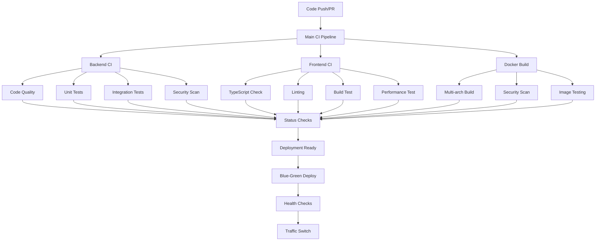

# CI/CD Pipeline Guide

This comprehensive guide covers the CI/CD pipeline implementation for the Dify project, including setup, usage, and troubleshooting.

## Overview

The Dify CI/CD pipeline implements automated testing, building, security scanning, and deployment processes using GitHub Actions. It follows industry best practices for continuous integration and deployment with Blue-Green deployment strategy.

## Pipeline Architecture



## Workflows

### 1. Main CI Pipeline (`.github/workflows/main-ci.yml`)

**Triggers:**
- Push to `main` or `develop` branches
- Pull requests to `main` or `develop` branches

**Features:**
- Path-based filtering to run only relevant tests
- Parallel execution of different test suites
- Comprehensive status reporting
- Integration with other workflows

### 2. Backend CI Pipeline (`.github/workflows/backend-ci.yml`)

**Components:**
- **Lint & Format**: Ruff formatting and linting
- **Type Checking**: basedpyright type validation
- **Unit Tests**: pytest with coverage reporting
- **Integration Tests**: Database and service tests
- **Security Scan**: Bandit security analysis
- **Build Test**: Production build verification

### 3. Frontend CI Pipeline (`.github/workflows/frontend-ci.yml`)

**Components:**
- **Type Checking**: TypeScript validation
- **Code Quality**: ESLint and Prettier
- **Unit Tests**: Jest test execution
- **Build Tests**: Production builds
- **Performance**: Lighthouse audits
- **Security**: npm audit checks

### 4. Docker Build & Security (`.github/workflows/docker-build.yml`)

**Features:**
- Multi-architecture builds (AMD64, ARM64)
- Layer caching for faster builds
- Trivy security scanning
- Image size optimization
- Vulnerability reporting

### 5. Status Checks (`.github/workflows/status-checks.yml`)

**Quality Gates:**
- Backend code quality
- Frontend code quality
- Docker security
- Deployment readiness

### 6. Notifications (`.github/workflows/notifications.yml`)

**Alerts:**
- Build status notifications (Slack/Discord)
- Coverage threshold alerts
- Security vulnerability alerts
- Daily deployment summaries

## Setup Instructions

### 1. Repository Configuration

```bash
# Clone the repository
git clone <repository-url>
cd dify-clone

# Verify workflow files
ls -la .github/workflows/
```

### 2. GitHub Secrets Configuration

Set up the following secrets in your GitHub repository:

#### Required Secrets
```bash
# Database
DB_HOST=your-database-host
DB_PASSWORD=secure-password
SECRET_KEY=your-flask-secret-key

# Redis
REDIS_HOST=your-redis-host
REDIS_PASSWORD=your-redis-password

# External Services
OPENAI_API_KEY=your-openai-key
SENTRY_DSN=your-sentry-dsn

# Notifications (Optional)
SLACK_WEBHOOK_URL=your-slack-webhook
DISCORD_WEBHOOK_URL=your-discord-webhook
```

See [GitHub Secrets Guide](./github-secrets.md) for detailed setup instructions.

### 3. Environment Configuration

Create environment-specific configurations:

```bash
# Development environment
cp .env.development .env

# Staging environment (for staging branch)
cp .env.staging .env.staging

# Production environment (for main branch)
cp .env.production .env.production
```

### 4. Branch Protection Rules

Configure branch protection for `main` and `develop` branches:

```yaml
# Required status checks
required_status_checks:
  - "Backend CI"
  - "Frontend CI"
  - "Docker Build Test"
  - "ci/deployment-readiness"

# Additional settings
require_review: true
dismiss_stale_reviews: true
require_code_owner_reviews: true
```

## Usage Guide

### Development Workflow

1. **Create Feature Branch**
   ```bash
   git checkout -b feature/your-feature-name
   git push -u origin feature/your-feature-name
   ```

2. **Make Changes**
   - Code changes trigger automatic quality checks
   - Local development should pass linting and tests

3. **Create Pull Request**
   - PR creation triggers full CI pipeline
   - Status checks provide real-time feedback
   - Automated comments provide detailed results

4. **Review and Merge**
   - All quality gates must pass
   - Code review approval required
   - Automatic deployment to staging (develop branch)

### Deployment Process

#### Staging Deployment
```bash
# Push to develop branch
git checkout develop
git merge feature/your-feature
git push origin develop
```

This triggers:
- Full CI pipeline execution
- Automated deployment to staging environment
- Health checks and verification

#### Production Deployment
```bash
# Create release PR to main
gh pr create --base main --head develop --title "Release v1.2.3"

# After review and approval, merge triggers:
# - Production build
# - Blue-green deployment
# - Health checks
# - Traffic switching
```

### Manual Operations

#### Running Scripts Locally

```bash
# Health checks
./scripts/health-check.sh --service all

# Blue-green deployment
./scripts/deploy.sh v1.2.3

# Rollback if needed
./scripts/rollback.sh --latest

# Manual backup
./scripts/backup_education_db.sh
```

#### Triggering Workflows

```bash
# Trigger specific workflow
gh workflow run "Backend CI Pipeline"

# View workflow status
gh run list

# View specific run
gh run view <run-id>
```

## Quality Standards

### Code Quality Requirements

#### Backend (Python)
- **Formatting**: Must pass Ruff formatting checks
- **Linting**: Zero Ruff linting errors
- **Type Safety**: All functions must have type hints
- **Testing**: Minimum 80% code coverage
- **Security**: No high/critical Bandit issues

#### Frontend (TypeScript)
- **Type Safety**: Strict TypeScript mode
- **Linting**: Zero ESLint errors
- **Formatting**: Prettier compliance
- **Testing**: Jest unit tests for components
- **Performance**: Lighthouse scores above thresholds

#### Docker
- **Security**: No critical vulnerabilities in images
- **Size**: Optimized multi-stage builds
- **Architecture**: Multi-platform support (AMD64/ARM64)

### Performance Benchmarks

```yaml
performance_thresholds:
  api_response_p90: 3000ms      # 90th percentile API response time
  api_response_p95: 5000ms      # 95th percentile API response time
  error_rate_normal: 0.01       # 1% error rate threshold
  error_rate_critical: 0.05     # 5% critical threshold

  resources:
    cpu_normal: 70%             # Normal CPU usage
    cpu_critical: 85%           # Critical CPU usage
    memory_normal: 2048MB       # Normal memory usage
    memory_critical: 3072MB     # Critical memory usage

  lighthouse:
    performance: 90             # Lighthouse performance score
    accessibility: 95           # Accessibility score
    best_practices: 90          # Best practices score
    seo: 90                     # SEO score
```

## Monitoring and Alerting

### Metrics Tracked

1. **Build Metrics**
   - Build success/failure rates
   - Build duration trends
   - Test execution times
   - Coverage trends

2. **Deployment Metrics**
   - Deployment frequency
   - Deployment success rates
   - Rollback frequency
   - Time to recovery

3. **Quality Metrics**
   - Code quality scores
   - Security vulnerability trends
   - Performance benchmarks
   - Test reliability

### Alert Conditions

#### Critical Alerts (Immediate Action)
- Build failures on `main` branch
- Security vulnerabilities in production images
- Deployment failures
- Health check failures after deployment

#### Warning Alerts (Monitor)
- Test coverage below 80%
- Performance degradation
- High error rates in staging
- Long build queue times

### Notification Channels

```yaml
notification_config:
  slack:
    webhook_url: "${SLACK_WEBHOOK_URL}"
    channels:
      critical: "#alerts-critical"
      warnings: "#alerts-general"
      deployments: "#deployments"

  discord:
    webhook_url: "${DISCORD_WEBHOOK_URL}"

  email:
    smtp_server: "${SMTP_SERVER}"
    recipients: ["team@company.com"]
```

## Troubleshooting

### Common Issues

#### 1. Build Failures

**Symptoms:** Red build status, failed tests
**Diagnosis:**
```bash
# Check workflow logs
gh run view --log

# Run tests locally
./dev/reformat
uv run --project api pytest
```

**Solutions:**
- Fix linting issues: `./dev/reformat`
- Address test failures
- Update dependencies if needed

#### 2. Docker Build Failures

**Symptoms:** Docker build step fails
**Diagnosis:**
```bash
# Build locally
docker build -t test-image api/
docker build -t test-image web/

# Check for dependency issues
docker run --rm -it test-image /bin/bash
```

**Solutions:**
- Fix Dockerfile syntax
- Update base images
- Resolve dependency conflicts

#### 3. Security Scan Failures

**Symptoms:** Trivy security scan reports vulnerabilities
**Diagnosis:**
```bash
# Run local security scan
docker run --rm -v /var/run/docker.sock:/var/run/docker.sock \
  aquasec/trivy:latest image your-image:tag
```

**Solutions:**
- Update vulnerable packages
- Use specific package versions
- Add vulnerability exceptions if needed

#### 4. Deployment Failures

**Symptoms:** Deployment script exits with errors
**Diagnosis:**
```bash
# Check deployment logs
./scripts/deploy.sh --dry-run v1.2.3

# Verify health checks
./scripts/health-check.sh --verbose
```

**Solutions:**
- Check environment variables
- Verify service connectivity
- Review health check endpoints

### Debug Commands

```bash
# View workflow runs
gh run list --workflow="Main CI Pipeline"

# Download artifacts
gh run download <run-id>

# Check repository secrets
gh secret list

# View branch protection status
gh api repos/:owner/:repo/branches/main/protection

# Test webhooks locally
curl -X POST -H "Content-Type: application/json" \
  -d '{"text":"Test message"}' \
  $SLACK_WEBHOOK_URL
```

### Recovery Procedures

#### Failed Deployment Recovery
1. **Immediate Actions:**
   ```bash
   # Check current status
   ./scripts/health-check.sh --service all

   # Rollback if necessary
   ./scripts/rollback.sh --latest --force
   ```

2. **Investigation:**
   - Check deployment logs
   - Review health check results
   - Verify database connectivity

3. **Resolution:**
   - Fix identified issues
   - Test in staging environment
   - Re-deploy with fixed version

#### Database Issues
1. **Backup Verification:**
   ```bash
   # List available backups
   ./scripts/rollback.sh --list

   # Test backup restore (dry run)
   ./scripts/restore_education_db.sh --dry-run
   ```

2. **Recovery:**
   ```bash
   # Restore from backup
   ./scripts/rollback.sh --db-only --latest
   ```

## Best Practices

### Development

1. **Code Quality**
   - Run linting and formatting before committing
   - Write tests for new functionality
   - Use type hints consistently
   - Follow security best practices

2. **Git Workflow**
   - Create focused feature branches
   - Write descriptive commit messages
   - Keep pull requests small and focused
   - Rebase before merging

3. **Testing**
   - Test locally before pushing
   - Write both unit and integration tests
   - Maintain test coverage above 80%
   - Mock external dependencies

### Deployment

1. **Environment Management**
   - Keep environment configurations in sync
   - Use secrets for sensitive data
   - Test configuration changes in staging first
   - Document environment differences

2. **Monitoring**
   - Monitor deployment metrics
   - Set up appropriate alerts
   - Review logs regularly
   - Conduct post-deployment verification

3. **Security**
   - Regular security scans
   - Keep dependencies updated
   - Rotate secrets regularly
   - Monitor for vulnerabilities

## Performance Optimization

### Build Performance

1. **Caching Strategies**
   ```yaml
   # Docker layer caching
   cache-from: type=gha,scope=build-cache
   cache-to: type=gha,mode=max,scope=build-cache

   # Dependency caching
   - uses: actions/setup-node@v4
     with:
       cache: pnpm
   ```

2. **Parallel Execution**
   - Run independent jobs in parallel
   - Use matrix builds for multiple environments
   - Split test suites for faster execution

3. **Resource Management**
   - Use appropriate runner sizes
   - Optimize Docker image sizes
   - Clean up temporary resources

### Pipeline Optimization

1. **Path-based Filtering**
   ```yaml
   - uses: dorny/paths-filter@v3
     with:
       filters: |
         backend: 'api/**'
         frontend: 'web/**'
   ```

2. **Conditional Execution**
   - Skip unnecessary steps
   - Use early termination for failures
   - Implement smart test selection

3. **Artifact Management**
   - Share artifacts between jobs
   - Clean up old artifacts
   - Compress large artifacts

## Security Considerations

### Pipeline Security

1. **Secret Management**
   - Use GitHub Secrets for sensitive data
   - Rotate secrets regularly
   - Audit secret access
   - Use least-privilege access

2. **Code Scanning**
   - Automated security scans in CI
   - Dependency vulnerability checks
   - Container image scanning
   - Static code analysis

3. **Access Control**
   - Branch protection rules
   - Required code reviews
   - Signed commits
   - Audit logs

### Deployment Security

1. **Environment Isolation**
   - Separate production credentials
   - Network segmentation
   - Access logging
   - Regular security updates

2. **Monitoring**
   - Security event monitoring
   - Anomaly detection
   - Incident response procedures
   - Regular security audits

## Maintenance

### Regular Tasks

1. **Weekly**
   - Review build metrics
   - Check for security updates
   - Monitor resource usage
   - Update dependencies

2. **Monthly**
   - Rotate secrets
   - Review alert thresholds
   - Clean up old artifacts
   - Performance analysis

3. **Quarterly**
   - Security audit
   - Disaster recovery testing
   - Pipeline optimization review
   - Documentation updates

### Upgrades and Updates

1. **GitHub Actions Updates**
   ```bash
   # Check for action updates
   github-actions-updater

   # Test with updated actions
   gh workflow run test-workflow
   ```

2. **Tool Updates**
   - Update runner images
   - Upgrade scanning tools
   - Update dependencies
   - Test compatibility

## Support and Resources

### Documentation
- [GitHub Actions Documentation](https://docs.github.com/en/actions)
- [Docker Best Practices](https://docs.docker.com/develop/dev-best-practices/)
- [Security Scanning Guide](./security-hardening.md)
- [Deployment Scripts](../scripts/README.md)

### Getting Help
1. Check workflow logs for detailed error messages
2. Review this documentation and related guides
3. Search existing issues in the repository
4. Create an issue with detailed information and logs

### Contributing
- Follow the established patterns for new workflows
- Test thoroughly in development environment
- Update documentation for any changes
- Get code review for workflow modifications

---

*This guide is maintained by the DevOps team. Last updated: $(date '+%Y-%m-%d')*